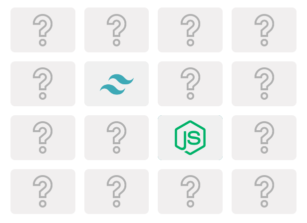
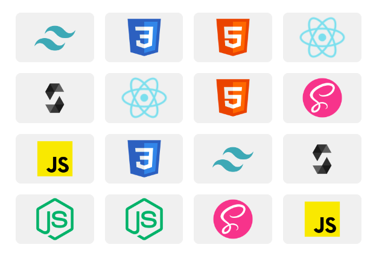

## Getting Started

First, run the development server:


```bash
nvm use
```

```bash
npm i 
# or
yarn
```

```bash
npm run dev
# or
yarn dev
```

### Technology
- nextjs
- scss

#### screenshot





